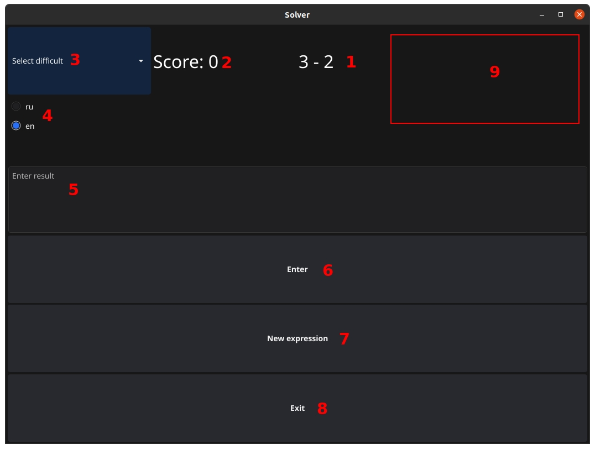

## ArithmeticSolverDesktop

A simple desktop application with a graphical interface for teaching simple arithmetic operations.

Libraries used https://github.com/fyne-io/fyne, https://github.com/fyne-io/fyne-cross (for testing), https://github.com/golang-design/clipboard and others from the go standard library.

### Explanations:
1. An arithmetic expression that requires a solution.
2. Points earned for correct solutions.
3. Selecting the complexity level of arithmetic expressions.
4. Selecting the interface language.
5. User result input window.
6. Button to check the entered answer.
7. New arithmetic expression button.
8. Closing the program window.
9. This area displays text messages about the correctness of the entered result.

